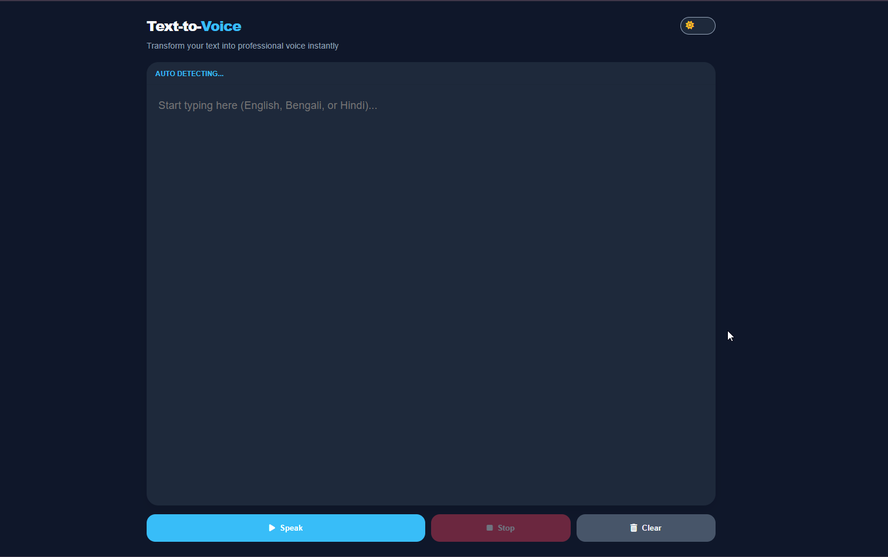
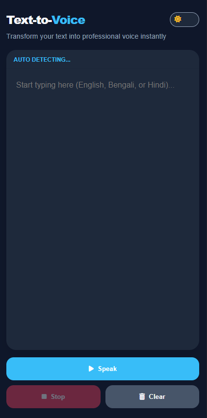

# Text-to-Voice 🎙️

A modern, browser-based **Text-to-Speech web application** that converts written text into natural-sounding voice using the **Web Speech API**.  
It supports **English, Bengali, and Hindi**, features **live word highlighting**, and includes a **dark/light theme toggle** for a polished user experience.

---

## 🚀 Features

- 🔊 Convert text to speech instantly
- 🌐 Automatic language detection (English, Bengali, Hindi)
- ✨ Live word-by-word highlighting during speech
- 🌙 Dark & light mode support
- 🎛️ Play, stop, and clear controls
- 📱 Fully responsive (desktop & mobile)
- ⚡ No external API required

---

## 🛠️ Built With

- **HTML5** – Semantic structure  
- **CSS3** – Modern theming & responsive UI  
- **Vanilla JavaScript** – Speech logic & interaction  
- **Web Speech API** – Native text-to-speech engine  

---

## 📸 Preview

| Desktop View | Mobile View |
|-------------|-------------|
|  |  |

---

## 🧠 How It Works

1. User enters text into the input area
2. Language is automatically detected using Unicode ranges
3. An appropriate system voice is selected
4. Speech is generated using the Web Speech API
5. Spoken words are highlighted in real time

---

## 📂 Project Structure

```plaintext
text-to-voice/
│
├── index.html      # App structure
├── style.css       # Styling & themes
├── script.js       # Speech logic & UI handling
└── README.md       # Documentation

